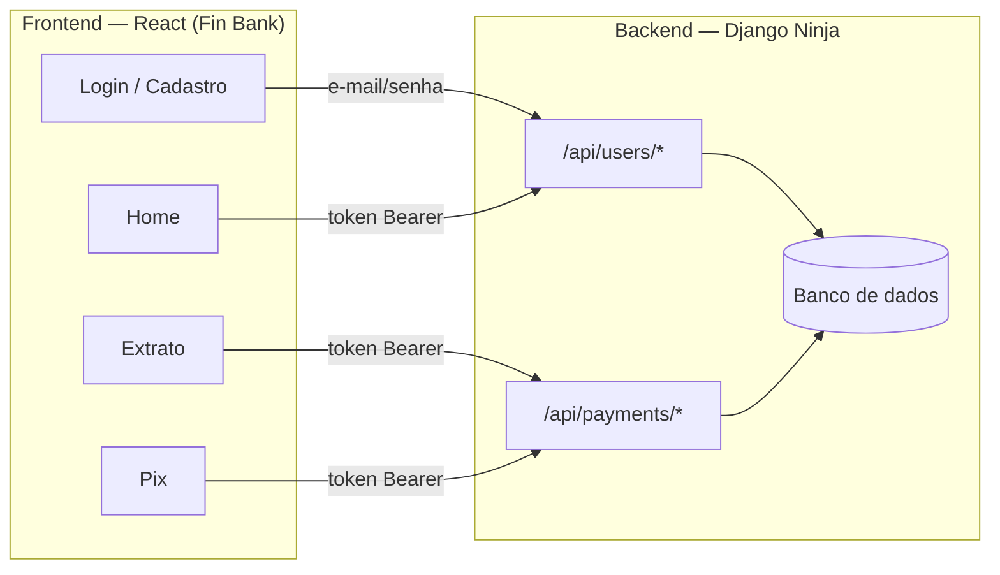

# 💳 Fin Bank — Sistema Bancário

Uma carteira digital construída do zero: **API em Django** no
backend e **interface em React** no frontend, com autenticação, transferências
entre usuários (Pix) e extrato — tudo com as regras de negócio e as
preocupações de segurança de um sistema financeiro real, em escala reduzida.

Este projeto foi feito para estudar e demonstrar, na prática, como um sistema
full stack é construído de ponta a ponta: modelagem de dados, API REST, regras
de negócio, autenticação, e uma interface que consome tudo isso.

---

## Índice

- [O que o app faz](#-o-que-o-app-faz)
- [Como é por dentro (arquitetura)](#️-como-é-por-dentro-arquitetura)
- [Tecnologias usadas](#️-tecnologias-usadas)
- [Estrutura de pastas](#-estrutura-de-pastas)
- [Como rodar o projeto na sua máquina](#-como-rodar-o-projeto-na-sua-máquina)
- [Endpoints da API](#-endpoints-da-api)
- [Regras de negócio: pessoa física x empresa](#-regras-de-negócio-pessoa-física-x-empresa)
- [Segurança](#-segurança)
- [Testes automatizados](#-testes-automatizados)
- [Identidade visual](#-identidade-visual)
- [Limitações conhecidas e próximos passos](#-limitações-conhecidas-e-próximos-passos)
- [Autora](#-autora)

---

## 📱 O que o app faz

Fin Bank é uma versão simplificada de uma carteira digital.
Um usuário pode:

1. **Criar uma conta**, como pessoa física ou como empresa.
2. **Fazer login** e ver seu saldo.
3. **Transferir dinheiro para outra pessoa (Pix)**, buscando o destinatário
   pelo CPF ou e-mail.
4. **Ver o extrato** de tudo que enviou e recebeu, com busca por nome.
5. **Receber um comprovante** ao final de cada transferência.

Contas do tipo **empresa** só podem *receber* dinheiro.

---

## 🏗️ Como é por dentro (arquitetura)

O projeto é dividido em duas partes que conversam por HTTP (API REST em
JSON), exatamente como um app bancário de verdade separa "o banco" (backend)
de "o aplicativo" (frontend):



- O **backend** guarda os dados (usuários, saldos, transações), aplica as
  regras de negócio e expõe tudo através de uma API.
- O **frontend** é só a "vitrine": ele não confia em nada que o usuário
  digita sem antes confirmar com o backend. Toda regra importante (saldo
  suficiente, permissão para transferir, etc.) é validada nos dois lados —
  no frontend para dar feedback rápido, e no backend porque é lá que a regra
  realmente vale.
- A comunicação entre os dois é autenticada por **token**: depois do login,
  o frontend guarda um token e o envia em toda requisição, provando "quem ele
  é" para o backend.

---

## 🛠️ Tecnologias usadas

### Backend

| Tecnologia | Para que serve aqui |
|---|---|
| **Python 3.11 + Django 5** | Framework principal, cuida do banco de dados e das regras de negócio |
| **Django Ninja** | Cria a API REST (parecido com o Django REST Framework, mas mais leve e com validação de dados via Pydantic) |
| **SQLite** | Banco de dados local, simples de rodar sem instalar nada extra |
| **django-role-permissions** | Controla o que cada tipo de conta (pessoa física / empresa) pode fazer |
| **django-cors-headers** | Permite que o frontend (em outra porta) converse com a API com segurança |
| **Celery + Redis** | Fila de tarefas assíncronas — usada para disparar notificações de transação sem travar a resposta da API |

### Frontend

| Tecnologia | Para que serve aqui |
|---|---|
| **React 19 + TypeScript** | Interface do usuário, com tipagem para evitar bugs bobos |
| **Vite** | Servidor de desenvolvimento e build, rápido e moderno |
| **Tailwind CSS v4** | Estilização (o tema preto/branco/dourado da marca Fin Bank) |
| **React Router** | Navegação entre as telas (login, home, extrato, pix...) |
| **Axios** | Chamadas HTTP para a API do backend |

---

## 📂 Estrutura de pastas

```
finbank/
├── core/                 # Configurações gerais do Django (settings, urls, celery)
├── users/                # Tudo sobre usuários: model, autenticação, validação de CPF
├── payments/             # Tudo sobre transferências: model, regras de negócio
├── requirements.txt      # Dependências do backend
├── manage.py             # Ponto de entrada do Django
│
└── frontend/             # Aplicação React (Fin Bank)
    └── src/
        ├── api/          # Funções que conversam com o backend (login, extrato, pix...)
        ├── components/   # Peças reutilizáveis de interface (botões, cards, menu...)
        ├── context/      # Estado global de autenticação (quem está logado)
        ├── hooks/        # Lógica reutilizável (ex: buscar transações)
        ├── pages/        # As telas em si (Login, Home, Extrato, Pix...)
        └── utils/        # Formatação de moeda/data e validações (CPF, e-mail...)
```

---

## 🚀 Como rodar o projeto na sua máquina

Pré-requisitos: **Python 3.11+** e **Node.js 18+** instalados. Redis é
opcional (só é usado se você quiser testar o envio assíncrono de
notificações — sem ele, o resto do app funciona normalmente).

### 1. Backend (a API)

```bash
# na raiz do projeto
python -m venv venv
source venv/bin/activate          # no Windows: venv\Scripts\activate
pip install -r requirements.txt

python manage.py migrate          # cria o banco de dados local
python manage.py runserver 8005   # sobe a API em http://localhost:8005
```

### 2. Frontend (a interface)

Em outro terminal:

```bash
cd frontend
cp .env.example .env    # já vem configurado para falar com localhost:8005
npm install
npm run dev              # sobe o app em http://localhost:3000
```

Abra **http://localhost:3000**, crie uma conta e pronto — o app já está
funcionando ponta a ponta.

> 💡 **Observação:** contas novas começam com saldo **R$ 0,00** (não existe
> uma tela de "depósito", pois isso não fazia parte do escopo original do
> desafio). Para testar uma transferência, crie duas contas e adicione saldo
> a uma delas pelo Django Admin (`http://localhost:8005/admin/`, com um
> usuário criado via `python manage.py createsuperuser`).

---

## 📡 Endpoints da API

Todos os endpoints ficam sob o prefixo `/api/`. Os marcados com 🔒 exigem o
cabeçalho `Authorization: Bearer <token>` (obtido no login).

| Método | Rota | Protegido? | O que faz |
|---|---|:---:|---|
| `POST` | `/users/` | — | Cria uma conta nova (pessoa física ou empresa) |
| `POST` | `/users/login/` | — | Faz login e retorna um token de acesso |
| `POST` | `/users/logout/` | 🔒 | Invalida o token atual |
| `GET` | `/users/me/` | 🔒 | Retorna os dados e o saldo do usuário logado |
| `GET` | `/users/search/?q=` | 🔒 | Busca um destinatário por CPF ou e-mail (exato) |
| `POST` | `/payments/` | 🔒 | Faz uma transferência para outro usuário |
| `GET` | `/payments/` | 🔒 | Lista o extrato (envios e recebimentos) do usuário logado |

---

## 👥 Regras de negócio: pessoa física x empresa

O tipo de conta define o que o usuário pode fazer:

| Permissão | Pessoa física | Empresa |
|---|:---:|:---:|
| Enviar dinheiro | ✅ | ❌ |
| Receber dinheiro | ✅ | ✅ |

Ou seja: uma conta de **empresa** funciona como uma conta de recebimento (tipo
um lojista), ela pode vender e receber, mas não pode fazer transferências
para outras contas.

---

## 🔒 Segurança

Alguns cuidados que foram tomados de propósito, pensando em como um sistema
que mexe com dinheiro precisa se comportar:

- **Senhas nunca são guardadas em texto puro** — o Django faz o hash antes de
  salvar no banco.
- **Toda ação sensível exige autenticação** por token (ver extrato, transferir
  dinheiro, ver o próprio perfil).
- **Quem paga é sempre "quem está logado", nunca um ID enviado pelo
  cliente.** Isso evita um problema clássico de segurança (conhecido como
  IDOR), em que alguém mal-intencionado poderia tentar descontar saldo da
  conta de outra pessoa só trocando um número na requisição.
- **CPF é validado com o algoritmo real de dígito verificador**, tanto no
  frontend (feedback na hora) quanto no backend (validação que realmente
  vale).
- **CORS restrito**: só o endereço do frontend (`localhost:3000` em
  desenvolvimento) pode fazer requisições à API — não é uma API aberta para
  qualquer site.
- **Busca de destinatário só por dado exato** (CPF ou e-mail completo) — não
  existe uma busca por nome parcial, para não permitir que qualquer pessoa
  logada consiga "listar" outros usuários do sistema.

---

## 🧪 Testes automatizados

O backend tem testes cobrindo as partes mais sensíveis: autenticação, busca
de usuários e as regras de transferência (saldo insuficiente, permissões por
tipo de conta, impedir transferência para si mesmo).

```bash
python manage.py test
```

---

## 🎨 Identidade visual

O frontend segue uma identidade visual própria — **preto, branco e dourado**
— pensada para transmitir a seriedade de um app financeiro, com um toque
premium. A interface é **responsiva**: funciona bem tanto em um celular
pequeno quanto em uma tela de desktop.

---

## 🔭 Limitações conhecidas e próximos passos

Este projeto tem escopo propositalmente enxuto. Coisas que ficaram de fora,
mas que dariam para evoluir:

- Depósito/recarga de saldo (hoje o saldo só muda por transferência).
- Cartão de crédito e fatura.
- Notificações reais por e-mail/push (hoje a fila do Celery já existe, mas a
  notificação em si é só um exemplo simples).
- Limite de tentativas de login (rate limiting).
- Deploy em produção (hoje pensado para rodar localmente, com SQLite).

---

## 👩‍💻 Autora

Feito por **Bárbara de Figueredo Matias**
— [github.com/BarbaraFigueredo](https://github.com/BarbaraFigueredo)
